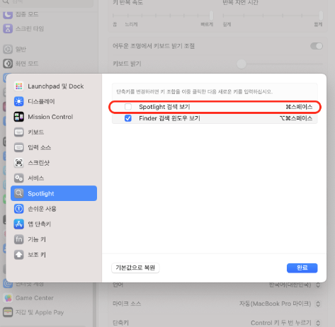
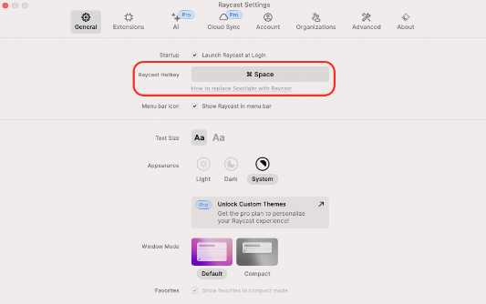

- resources #research
	- 내용
		- hombrew
			- mas: 홈브루에서 설치 안되는 앱 설치용
			  collapsed:: true
				- kakao: 카톡
			- iterm2: 터미널
			  collapsed:: true
				- ```shell
				  # 1. oh-my-zsh 설치
				  sh -c "$(curl -fsSL https://raw.github.com/ohmyzsh/ohmyzsh/master/tools/install.sh)"
				  
				  # 2. .zshrc 파일열기
				  vi ~/.zshrc
				  
				  # 3. .zshrc파일에서 아래 내용 추가/수정
				  ## ZSH_THEME 수정
				  ZSH_THEME="agnoster"
				  
				  ## 컴퓨터 이름 제거
				  prompt_context() {
				      if [[ "$USER" != "$DEFAULT_USER" || -n "$SSH_CLIENT" ]]; then
				        prompt_segment black default "%(!.%.)$USER"
				    fi
				  }
				  ## zsh 플러그인(먼저 옆에꺼 설치 -> brew install zsh-syntax-highlighting)
				  source /opt/homebrew/share/zsh-syntax-highlighting/zsh-syntax-highlighting.zsh
				  
				  # 4. 저장후 적용
				  source  ~/.zshrc
				  ```
				- 폰트 적용
					- [d2폰트](https://github.com/naver/d2codingfont/?tab=readme-ov-file)설치
					- 적용
						- 
				- 컬러 테마 적용
					- [https://iterm2colorschemes.com/](https://iterm2colorschemes.com/)에서 원하는 컬러테마 선택
					- 적당한 경로로 이동후 컬러 테마 다운로드
						- ```shell
						  curl -LO [원하는 테마의 URL]
						  ```
					- iTerm2의 설정에서 테마 임포트후 지정
						- {:height 360, :width 687}
				- 상태바 설정
					- configure status bar클릭 -> 추가하고 싶은 거 추가
						- 
			- google-chrome: 인터넷 브라우저
			- iina: 동영상 플레이어
			- aldente: 배터리 관리
			- visual-studio-code: 편집기
			- keyboardcleantool: 키보드 청소용
			- appcleaner: 앱 완전 삭제
			- raycast: 스포트라이트 대용
			  collapsed:: true
				- 스포트라이트에 할당된 단축키 변경하기
					- 시스템 설정에서 키보드 -> 키보드설정 -> 스포트라이트 단축키 해제
						- 
					- raycast설정에서 변경
						- 
			- ~~rectangle: 창 위치 이동 단축키~~
			  collapsed:: true
				- raycast에 포함됨
			- loptions+: 로지텍 제품 관리
			- nvm: node 패키지 메니저
			  collapsed:: true
				- 환경변수 설정
				  collapsed:: true
					- 디렉토리 생성
						- ```shell
						  mkdir ~/.nvm
						  ```
					- .zshrc 설정
						- ```shell
						  export NVM_DIR="$HOME/.nvm"
						  [ -s "/opt/homebrew/opt/nvm/nvm.sh" ] && \. "/opt/homebrew/opt/nvm/nvm.sh"  # This loads nvm
						  [ -s "/opt/homebrew/opt/nvm/etc/bash_completion.d/nvm" ] && \. "/opt/homebrew/opt/nvm/etc/bash_completion.d/nvm"  # This loads nvm bash_completion
						  ```
					- 적용
						- ```shell
						  source ~/.zshrc
						  ```
			- slack
			- postman
			- notion
			- docker: 도커
	- 출처
	- 태그
		- #mac #개발환경
	- **메모**
		- visual-studio-code 세팅 방법 알아보기