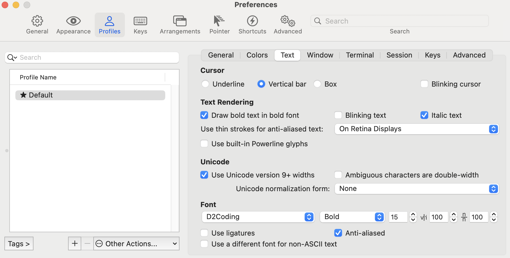
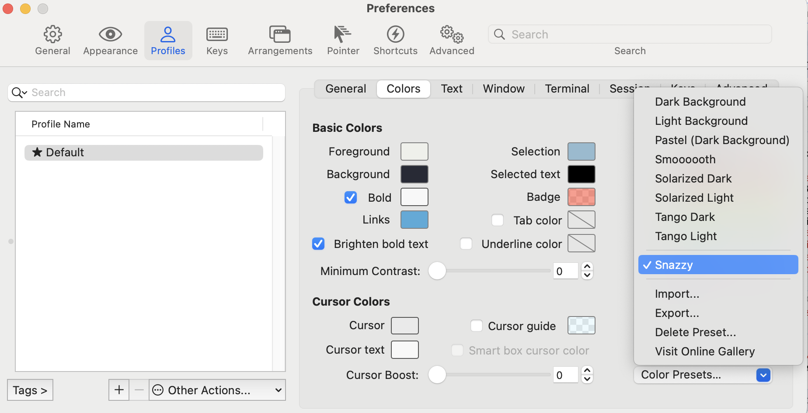

- 앱 설치 / 기본 설정
	- hombrew
		- mas: 홈브루에서 설치 안되는 앱 설치용
			- kakao: 카톡
		- google-chrome: 인터넷 브라우저
		- iina: 동영상 플레이어
		- visual-studio-code: 편집기
			- todo: code 명령어 설정 알아보기
		- keyboardcleantool: 키보드 청소용
		- appcleaner: 앱 완전 삭제
		- raycast: 스포트라이트 대용
		  collapsed:: true
			- 스포트라이트에 할당된 단축키 변경하기
				- 시스템 설정에서 스포트라이트 단축키 해제
					- 
				- raycast설정에서 변경
					- 
		- iterm2: 터미널
		  collapsed:: true
			- ```shell
			  # 1. oh-my-zsh 설치
			  sh -c "$(curl -fsSL https://raw.github.com/ohmyzsh/ohmyzsh/master/tools/install.sh)"
			  
			  # 2. .zshrc 파일열기
			  vi ~/.zshrc
			  
			  # 3. .zshrc파일에서 아래 내용 추가/수정
			  ## ZSH_THEME 수정
			  ZSH_THEME="agnoster"
			  
			  ## 컴퓨터 이름 제거
			  prompt_context() {
			      if [[ "$USER" != "$DEFAULT_USER" || -n "$SSH_CLIENT" ]]; then
			        prompt_segment black default "%(!.%.)$USER"
			    fi
			  }
			  ## zsh 플러그인(먼저 옆에꺼 설치 -> brew install zsh-syntax-highlighting)
			  source /opt/homebrew/share/zsh-syntax-highlighting/zsh-syntax-highlighting.zsh
			  
			  # 4. 저장후 적용
			  source  ~/.zshrc
			  ```
			- 폰트 적용
			  collapsed:: true
				- [d2폰트](https://github.com/naver/d2codingfont/?tab=readme-ov-file)설치
				- 적용
					- 
			- 컬러 테마 적용
			  collapsed:: true
				- [https://iterm2colorschemes.com/](https://iterm2colorschemes.com/)에서 원하는 컬러테마 선택
				- 적당한 경로로 이동후 컬러 테마 다운로드
					- ```shell
					  curl -LO [원하는 테마의 URL]
					  ```
				- iTerm2의 설정에서 테마 임포트후 지정
					- {:height 360, :width 687}
			- 상태바 설정
			  collapsed:: true
				- configure status bar클릭 -> 추가하고 싶은 거 추가
					- 
			-
		- rectangle: 창 위치 이동 단축키
		- docker: 도커
		- dbeaver-community
		- nvm: node 패키지 메니저
		  collapsed:: true
			- 환경변수 설정
			  collapsed:: true
				- 디렉토리 생성
					- ```shell
					  mkdir ~/.nvm
					  ```
				- .zshrc 설정
					- ```shell
					  export NVM_DIR="$HOME/.nvm"
					  [ -s "/opt/homebrew/opt/nvm/nvm.sh" ] && \. "/opt/homebrew/opt/nvm/nvm.sh"  # This loads nvm
					  [ -s "/opt/homebrew/opt/nvm/etc/bash_completion.d/nvm" ] && \. "/opt/homebrew/opt/nvm/etc/bash_completion.d/nvm"  # This loads nvm bash_completion
					  ```
				- 적용
					- ```shell
					  source ~/.zshrc
					  ```
-
- 자동설치 shell 스크립트(구성중)
  collapsed:: true
	- ```shell
	  #!/bin/bash
	  
	  # 홈브루가 설치되어 있는지 확인
	  if command -v brew &> /dev/null; then
	      echo "홈브루가 이미 설치되어 있습니다."
	  else
	      # 홈브루 설치
	      /bin/bash -c "$(curl -fsSL https://raw.githubusercontent.com/Homebrew/install/HEAD/install.sh)"
	      echo "홈브루가 설치되었습니다."
	  fi
	  
	  # 설치할 일반 패키지 리스트
	  PACKAGES=(
	  	nvm
	  )
	  
	  # 설치할 cask 패키지 리스트
	  CASK_PACKAGES=(
	      google-chrome
	      visual-studio-code
	      dbeaver-community
	      postman
	      slack
	  )
	  
	  echo "설치할 일반 패키지 리스트: ${PACKAGES[@]}"
	  echo "설치할 cask 패키지 리스트: ${CASK_PACKAGES[@]}"
	  
	  # 일반 패키지 설치
	  for PACKAGE in "${PACKAGES[@]}"; do
	      brew install $PACKAGE
	  done
	  
	  # cask 패키지 설치
	  for CASK in "${CASK_PACKAGES[@]}"; do
	      brew install --cask $CASK
	  done
	  
	  echo "설치 완료!"
	  ```