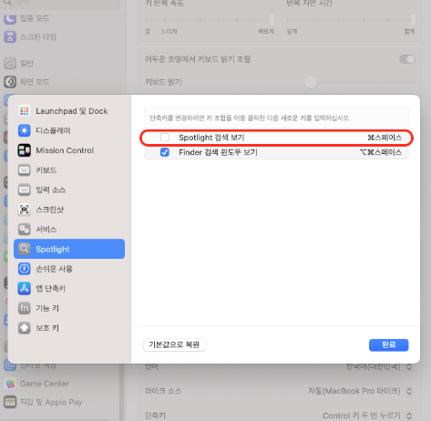
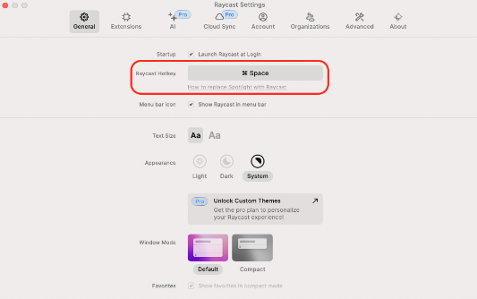

- #resources research
	- 내용
		- [[homebrew]] : 설치 매니저
			- mas: 홈브루에서 설치 안되는 앱 설치용
			  collapsed:: true
				- kakao: 카톡
			- [[iTerm2]] : 터미널
			- google-chrome: 인터넷 브라우저
			- iina: 동영상 플레이어
			- aldente: 배터리 관리
			- visual-studio-code: 편집기
			- keyboardcleantool: 키보드 청소용
			- appcleaner: 앱 완전 삭제
			- raycast: 스포트라이트 대용
			  collapsed:: true
				- 스포트라이트에 할당된 단축키 변경하기
					- 시스템 설정에서 키보드 -> 키보드설정 -> 스포트라이트 단축키 해제
						- 
					- raycast설정에서 변경
						- 
			- ~~rectangle: 창 위치 이동 단축키~~
			  collapsed:: true
				- raycast에 포함됨
			- loptions+: 로지텍 제품 관리
			- nvm: node 패키지 메니저
			  collapsed:: true
				- 환경변수 설정
				  collapsed:: true
					- 디렉토리 생성
						- ```shell
						  mkdir ~/.nvm
						  ```
					- .zshrc 설정
						- ```shell
						  export NVM_DIR="$HOME/.nvm"
						  [ -s "/opt/homebrew/opt/nvm/nvm.sh" ] && \. "/opt/homebrew/opt/nvm/nvm.sh"  # This loads nvm
						  [ -s "/opt/homebrew/opt/nvm/etc/bash_completion.d/nvm" ] && \. "/opt/homebrew/opt/nvm/etc/bash_completion.d/nvm"  # This loads nvm bash_completion
						  ```
					- 적용
						- ```shell
						  source ~/.zshrc
						  ```
			- slack
			- postman
			- notion
			- docker: 도커
	- 출처
		-
	- 태그
		- #mac #개발환경
	- **메모**
		- visual-studio-code 세팅 방법 알아보기