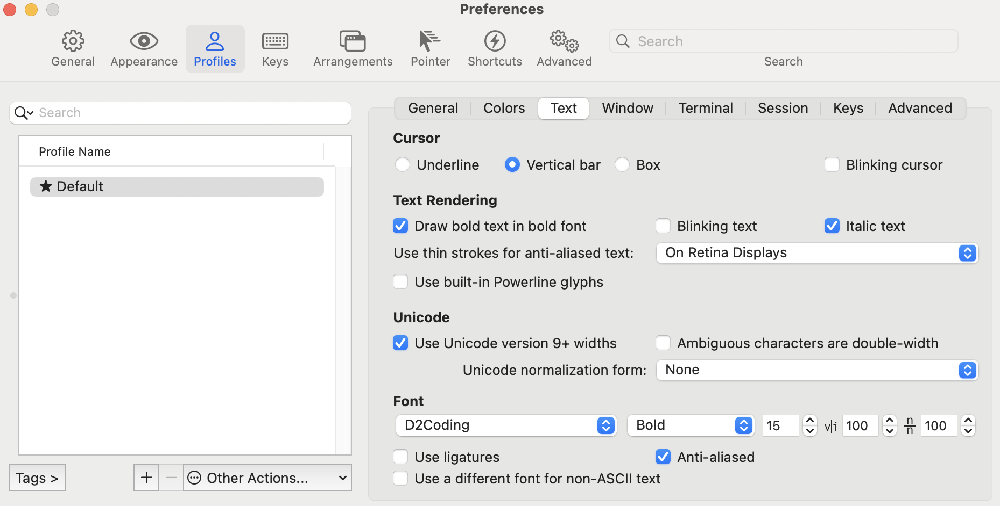

- #resources research
	- **내용**
		- 설치
			- ```
			  brew install --cask iterm2
			  ```
		- Oh-My-Zsh 설치
			- ```shell
			  sh -c "$(curl -fsSL https://raw.github.com/ohmyzsh/ohmyzsh/master/tools/install.sh)"
			  ```
		- 테마 변경
			- ```shell
			  ## 파일열기
			  vi ~/.zshrc
			  
			  ## ZSH_THEME찾아서 아래 내용으로 수정
			  ZSH_THEME="agnoster"
			  
			  ## 저장후 적용
			  source  ~/.zshrc
			  ```
			- agnoster 이외의 테마는 https://github.com/ohmyzsh/ohmyzsh/wiki/Themes 여기 참고
		- 컴퓨터 이름제거
			- ```shell
			  ## .zshrc에 아래 내용 추가
			  # 컴퓨터 이름 제거
			  prompt_context() {
			      if [[ "$USER" != "$DEFAULT_USER" || -n "$SSH_CLIENT" ]]; then
			        prompt_segment black default "%(!.%.)$USER"
			    fi
			  }
			  
			  ## 저장후 적용
			  source  ~/.zshrc
			  ```
		- zsh 플러그인 설치(Syntax Highlighting, Auto Suggestion)
			- ```shell
			  ## 브루로 설치
			  brew install zsh-syntax-highlighting
			  brew install zsh-autosuggestions
			  
			  ## .zshrc에 아래 내용 추가
			  # zsh 플러그인
			  source /opt/homebrew/share/zsh-syntax-highlighting/zsh-syntax-highlighting.zsh
			  source /opt/homebrew/share/zsh-autosuggestions/zsh-autosuggestions.zsh
			  
			  ## 저장후 적용
			  source  ~/.zshrc
			  ```
		- 폰트 적용
			- [d2폰트](https://github.com/naver/d2codingfont/?tab=readme-ov-file)설치
			- 적용
				- 
		- 컬러 테마 적용
			- [https://iterm2colorschemes.com/](https://iterm2colorschemes.com/)에서 원하는 컬러테마 선택
			- 적당한 경로로 이동후 컬러 테마 다운로드
				- ```shell
				  curl -LO [원하는 테마의 URL]
				  ```
			- iTerm2의 설정에서 테마 임포트후 지정
				- {:height 360, :width 687}
		- 상태바 설정
			- configure status bar클릭 -> 추가하고 싶은 거 추가
				- {:height 443, :width 687}
		-
	- **출처**
		- 출처 작성
	- **태그**
		- #iTerm2 #태그2
	- **메모**