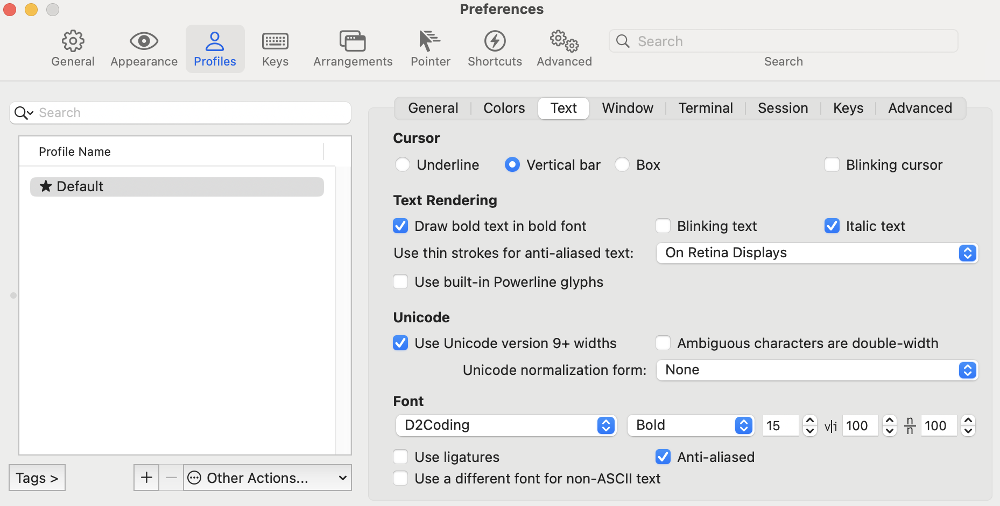
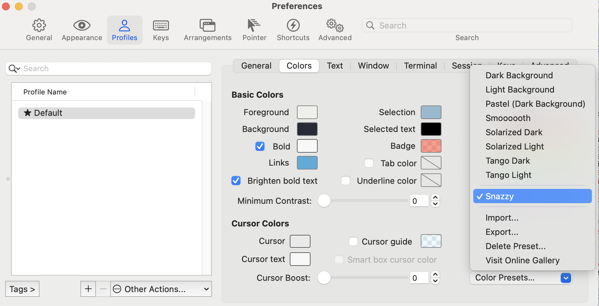
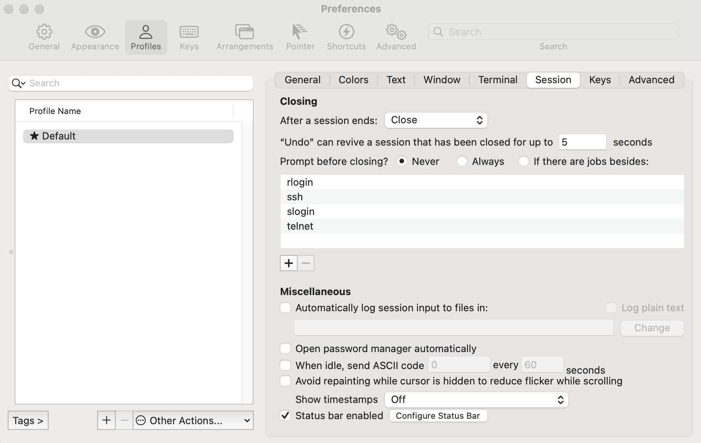

- 설치
	- brew로 iTerm2 설치
		- ```shell
		  brew install --cask iterm2
		  ```
- iTerm2 꾸미기
	- Oh-My-Zsh 설치s
		- ```shell
		  sh -c "$(curl -fsSL https://raw.github.com/ohmyzsh/ohmyzsh/master/tools/install.sh)"
		  ```
	- 테마 변경
		- ```shell
		  ## 파일열기
		  vi ~/.zshrc
		  
		  ## ZSH_THEME찾아서 아래 내용으로 수정
		  ZSH_THEME="agnoster"
		  
		  ## 저장후 적용
		  source  ~/.zshrc
		  ```
		- agnoster 이외의 테마는 https://github.com/ohmyzsh/ohmyzsh/wiki/Themes 여기 참고
	- 컴퓨터 이름제거
		- ```shell
		  ## .zshrc에 아래 내용 추가
		  # 컴퓨터 이름 제거
		  prompt_context() {
		      if [[ "$USER" != "$DEFAULT_USER" || -n "$SSH_CLIENT" ]]; then
		        prompt_segment black default "%(!.%.)$USER"
		    fi
		  }
		  
		  ## 저장후 적용
		  source  ~/.zshrc
		  ```
	- zsh 플러그인 설치(Syntax Highlighting, Auto Suggestion)
		- ```shell
		  ## 브루로 설치
		  brew install zsh-syntax-highlighting
		  brew install zsh-autosuggestions
		  
		  ## .zshrc에 아래 내용 추가
		  # zsh 플러그인
		  source /opt/homebrew/share/zsh-syntax-highlighting/zsh-syntax-highlighting.zsh
		  source /opt/homebrew/share/zsh-autosuggestions/zsh-autosuggestions.zsh
		  
		  ## 저장후 적용
		  source  ~/.zshrc
		  ```
	- 폰트 적용
		- [d2폰트](https://github.com/naver/d2codingfont/?tab=readme-ov-file)설치
		- 적용
			- 
	- 컬러 테마 적용
		- [https://iterm2colorschemes.com/](https://iterm2colorschemes.com/)에서 원하는 컬러테마 선택
		- 적당한 경로로 이동후 컬러 테마 다운로드
			- ```shell
			  curl -LO [원하는 테마의 URL]
			  ```
		- iTerm2의 설정에서 테마 임포트후 지정
			- 
	- 상태바 설정
		- configure status bar클릭 -> 추가하고 싶은 거 추가
			- 
- 단축키 / 사용법
-
- 참고
  collapsed:: true
	- https://velog.io/@yejin25/iTerm-%EC%BB%A4%EC%8A%A4%ED%84%B0%EB%A7%88%EC%9D%B4%EC%A6%88-%ED%95%98%EA%B8%B0