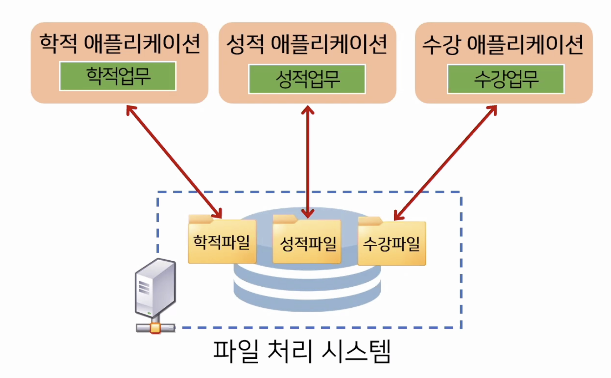
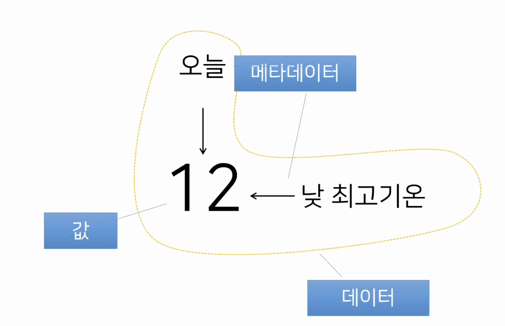
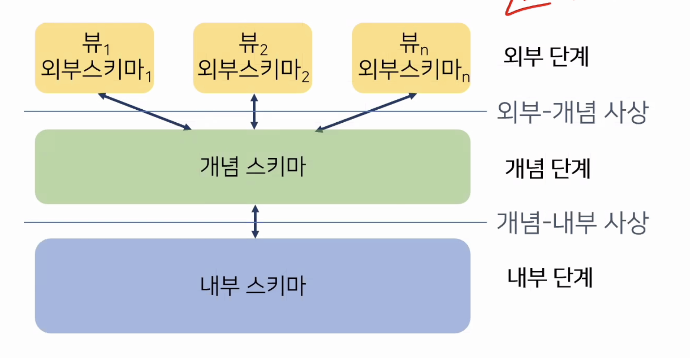
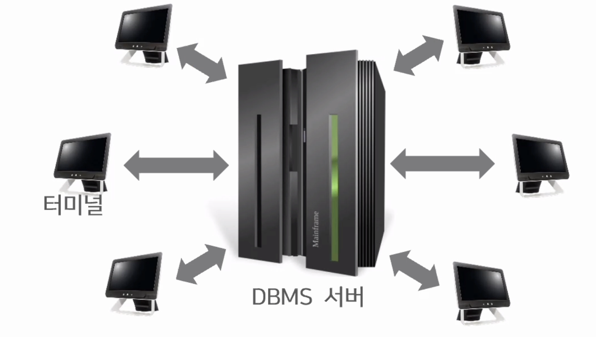
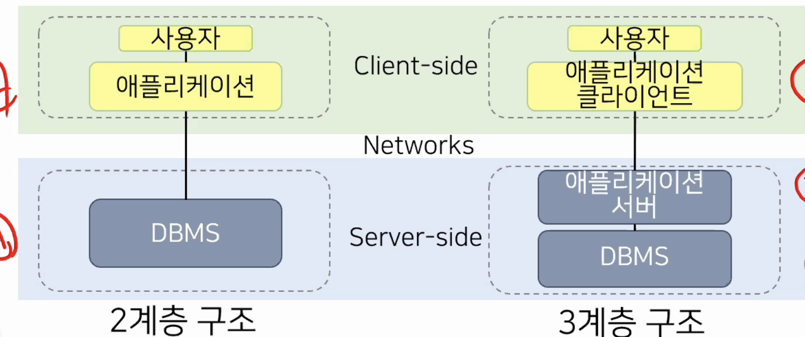

- #resources
	- **내용**
		- 파일 처리 시스템
		  collapsed:: true
			- 데이터 베이스 시스템 이전의 관리 방식
			- 전통적 데이터 관리 방식(중앙에서 모든 데이터를 관리)
				- 
				  id:: 66022a21-27ad-4061-9928-ae851753b0ed
			- 파일처리 시스템에서 발생 가능한 문제
				- 데이터 종속의 문제
					- 저장된 데이터를 특정 에플리케이션 에서만 사용될 수 있는 문제
						- 물리적 데이터 종속
						- 논리적 데이터 종속
				- 데이터 중복의 문제
					- 하나의 조직에서 여러 에플리케이션을 사용하는데 중복된 역할이 있을 수 밖에 없기 때문에 일관성, 보안성, 경제성 측면에서 생기는 문제
					  id:: 66022bbc-41da-4eec-b669-c743995671a7
						- 일관성
						  id:: 66022c3d-2002-48aa-b471-af1c42d6619e
							- 한 사실에 대해 한 개의 데이터 값을 유지
						- 보안성
							- 같은 데이터에 같은 수준의 보안 유지
						- 경제성
							- 데이터에 대해 최소한의 저장 공간 만을 점유
				- 무결성 훼손의 문제
					- 파일 처리 시스템은 데이터 무결성을 보장하기 위한 기능이 없음
						- 데이터 무결성
							- 데이터의 정확성 보장
							- 데이터의 값과 값에 대한 제약조건을 동시에 만족
				- 동시 접근의 문제
					- 하나의 데이터에 2개 이상의 데이터 조작요청이 생길때 생기는 문제
		- 데이터 베이스 시스템
		  collapsed:: true
			- 값, 데이터, 메타데이터
				- 
			- DBMS의 3단계 구조
				- 외부단계, 개념단계, 내부단계
					- 
			- 트랜잭션
				- 하나의 논리적인 작업을 처리하기 위한 일련의 데이터베이스 명령의 집합
		- 데이터베이스 언어
		  collapsed:: true
			- 역할에 따라 종류의 언어로 구분
				- 데이터 정의 언어(DDL)
				- 데이터 조작 언어(DML)
			- 현대의 데이터 베이스 언어는 자연어와 유사한 형태로 SQL 표준화
		- 데이터베이스 아키텍쳐
		  collapsed:: true
			- 중앙집중방식
				- 
				- 단일 서버가 다수의 클라이언트 장치를 대신하여 작동
					- 중앙 컴퓨터 과부화로 전체적인 성능 저하
			- 분산시스템 방식
				- 
				- 3계층 구조가 웹개발등에서 사용되는 대표적인 시스템
		- 데이터베이스 모델링의 개념
		  collapsed:: true
			- 데이터의 의미를 파악하고 데이터와 관여하는 업무 프로세스를 개념 정의하고 분석하는 작업
		- 데이터베이스 모델링의 단계
		  collapsed:: true
			- 개념적 데이터 모델링
				- 요구사항의 해석, 오류를 방지
				- 실 세계의 데이터를 개념적으로 일반화한다.
				- ER 모델
					- 개념적 데이터 모델링은 99%가 ER모델을 사용한다.
			- 논리적 데이터 모델링
			- 물리적 데이터 모델링
	- **출처**
	- **태그**
		- #방통대
	- **메모**
		- 메모 작성