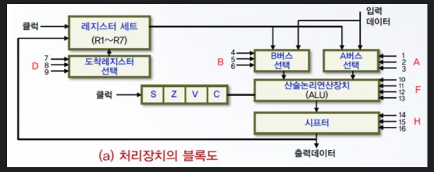

- resource
	- **내용**
		- 산술연산
			- ADD : 덧셈
			- SUB : 뺄셈
			- MUL : 곱셈
			- DIV : 나눗셈
		- 명령어를 구성하는 대표적인 필드
			- 주소 필드, 해석방법 지정하는 방식 필드, 연산코드 필드
		- 컴퓨터 명령어
			- ADD x : 누산기
			- ADD R1, R2, R3 : 다중 레지스터
		- 주소지정방식
			- 즉치 주소지정방식 : ac <- nbrs
			- 직접 주소지정방식 : ac <- m[adrs]
			- 간접 주소지정방식 : ac <- m[m[adrs]]
			- 상대 주소지정방식 : ac <- m[adrs + pc + 2]
			- 인덱스 주소지정방식 : ac <- m[adrs + r1]
			- 레지스터 주소지정방식 : ac <- r1
			- 레지스터 간접 주소지정방식 : ac <- m[r1]
		- 제어단어의 각 필드
			- A,B : 출발 레지스터
			- D : 도착 레지스터
			- F : ALU 연산 하나선택
			- H : 시프터
		- 처리장치 블록도
			- 
			- 레지스터 세트에 63개의 레지스터, 산술논리연산이 20개의 연산, 시프터가 15개의 연산, 제어단어는 몇 비트?
				- 2^6 = 64임으로 레지스터 세트 63개를 포함, 6비트가 필요
					- 선택 레지스터 2개 6비트, 도착 레지스터 1개 6비트 총 3개 6비트
				- 2^5 = 32임으로 산술논리연산 20개를 포함, 5비트가 필요
				- 2^4 = 16임으로 시프터가 15개포함, 4비트 필요
				- 총 6 + 6 + 6 + 5 + 4 = 27비트
		- 레지스터
			- AC : 데이터를 기억
			- PC :
			- SP :
			- IR : 연산코드 보관
		- 명령어 수행 사이클
			- 인출, 인터럽트, 실행
		- 캐시, 주기억장치 사이의 데이터 교환
			- mapping
		- 컴퓨터 내부장치와 입출력 장치의 차이점
			- 전송속도, 처리단위, 에러율
		- 내부버스
			- 공통 선로의 집합
			- 멀티플랙서와 디코더를 이용해 구성가능
			- 중앙처리장치 내부에서 종보를 전달할 수 있는 경로
		- 버스의 사용을 중재하는 방법
			- 병렬, 폴링, 데이지 체인
	- **출처**
	- **태그**
		- #방통대
	- **메모**
-